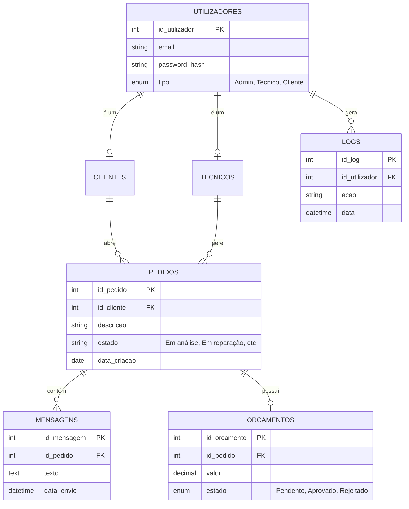

00 # Documentação do Projeto InfoConnect

> **Curso Profissional de Técnico de Gestão e Programação de Sistemas Informáticos**
> **Prova de Aptidão Profissional (PAP)**
>
> **Aluno:** Douglas Anjos (Nº 3)
> **Projeto:** Plataforma Digital - InfoConnect
> **Ano:** 2023 / 2026
> **Local:** Cantanhede

---

## 1. Arquitetura Geral do Projeto

O **InfoConnect** é uma plataforma web *Full-Stack* para gestão de suporte técnico, desenhada para facilitar a comunicação entre clientes e técnicos. A arquitetura baseia-se no modelo **Client-Server**:

*   **Frontend (SPA - Single Page Application):**
    *   Desenvolvido em **React** (v19) com **TypeScript**.
    *   Utiliza **Vite** para compilação rápida e Hot Module Replacement (HMR).
    *   Estilização moderna e responsiva com **Tailwind CSS**.
    *   Ícones vetoriais da biblioteca **Lucide React**.
*   **Backend (API RESTful):**
    *   Servidor **Node.js** com framework **Express**.
    *   Gerenciamento de uploads de ficheiros com **Multer**.
    *   Envio de emails transacionais via **Nodemailer**.
    *   Autenticação segura e encriptação de senhas com **Bcrypt**.
*   **Base de Dados (Relacional):**
    *   **MySQL** (MariaDB) servido via XAMPP.
    *   Estrutura normalizada para gestão de utilizadores, tickets, mensagens e logs.

## 2. Estrutura do Projeto

A organização de ficheiros foi adaptada para desenvolvimento ágil, mantendo os componentes principais na raiz para fácil acesso:

*   **Raiz (`/`)**:
    *   `App.tsx`: O "coração" do frontend. Contém o **Router personalizado** (baseado em estado), gestão de autenticação global e lógica de troca de temas.
    *   `index.html`: Ponto de entrada da aplicação web.
    *   `index.tsx`: Renderização do React no DOM.
    *   `server.cjs`: O servidor Backend completo num ficheiro modular.
    *   `types.ts`: Definições de tipagem TypeScript (Interfaces para User, Ticket, etc.).
*   **Componentes (`/components`)**:
    *   `Dashboard.tsx`: Visão geral para administradores (estatísticas, gráficos).
    *   `ClientDashboard.tsx`: Área exclusiva do cliente para ver seus tickets.
    *   `TicketDetail.tsx`: Interface completa de gestão de um ticket (chat, orçamentos).
    *   `AuthPage.tsx`: Ecrã de Login e Registo.
    *   `NewTicketModal.tsx`: Formulário para abertura de novos pedidos.
    *   `UsersManagement.tsx`: Painel de administração de utilizadores.
    *   `SystemLogs.tsx`: Visualizador de logs de sistema (auditoria).
    *   `FAQSection.tsx`, `ReportsPanel.tsx`, `LandingPage.tsx`: Outros módulos funcionais.
*   **Serviços (`/services`)**:
    *   `api.ts`: Camada de abstração para comunicação com o Backend (fetch wrapper).
*   **Configuração**:
    *   `tailwind.config.js`: Personalização do tema visual.
    *   `vite.config.ts`: Configurações de build.

## 3. Instalação das Ferramentas

O ambiente de desenvolvimento requer as seguintes tecnologias:

1.  **Node.js (LTS)**: Ambiente de execução JavaScript.
2.  **XAMPP**: Pacote com servidor Apache e MySQL (phpMyAdmin).
3.  **Visual Studio Code**: IDE recomendado com extensões (ESLint, Prettier).\
4.  **Git**: Controlo de versões.

*(Recomenda-se adicionar aqui prints da instalação do Node e XAMPP)*

## 4. Configuração do Ambiente de Desenvolvimento

Para colocar o projeto a funcionar localmente:

1.  **Backend**:
    *   Iniciar o **MySQL** no XAMPP.
    *   Importar o esquema da base de dados (`bd_infoconnect`).
    *   Na raiz do projeto, executar:
        ```bash
        node server.cjs
        ```
        *Saída esperada: "Servidor InfoConnect a correr na porta 3000"*

2.  **Frontend**:
    *   Num novo terminal, executar:
        ```bash
        npm install  # Instalar dependências
        npm run dev  # Iniciar servidor Vite
        ```
    *   Aceder a `http://localhost:5173`.

## 5. Desenvolvimento do Backend (API)

O backend expõe uma **API REST** na porta 3000. Abaixo os principais *endpoints* desenvolvidos:

### Autenticação e Utilizadores
| Método | Endpoint | Descrição |
| :--- | :--- | :--- |
| `POST` | `/api/login` | Autentica utilizador e retorna token/dados. |
| `POST` | `/api/register` | Regista novos clientes. |
| `POST` | `/api/users` | Admin cria novos técnicos/admins. |
| `DELETE`| `/api/users/:id`| Remove um utilizador e seus dados associados. |

### Gestão de Pedidos (Tickets)
| Método | Endpoint | Descrição |
| :--- | :--- | :--- |
| `GET` | `/api/tickets` | Lista todos os tickets (com filtros). |
| `POST` | `/api/tickets` | Cria um novo ticket (suporta anexo). |
| `DELETE`| `/api/tickets/:id`| Apaga um ticket completo. |
| `PATCH` | `/api/tickets/:id/status`| Atualiza o estado (Em análise, Concluído...). |

### Comunicação e Orçamentos
| Método | Endpoint | Descrição |
| :--- | :--- | :--- |
| `GET` | `/api/tickets/:id/messages`| Obtém histórico do chat. |
| `POST` | `/api/tickets/:id/messages`| Envia nova mensagem (notifica por email). |
| `POST` | `/api/tickets/:id/budget` | Cria ou atualiza orçamento. |

### Sistema
| Método | Endpoint | Descrição |
| :--- | :--- | :--- |
| `GET` | `/api/logs` | Lista logs de auditoria do sistema. |
| `POST` | `/api/logs` | Regista uma ação importante. |
| `POST` | `/api/settings` | Guarda configurações globais. |

## 6. Desenvolvimento do Frontend

A interface foi focada na usabilidade (**UX/UI**).

*   **Template da Interface**: O design base e a estrutura visual foram fornecidos pela ferramenta **Google AI Studio**.
*   **Sistema de Rotas Personalizado**: Em vez de usar bibliotecas externas pesadas, foi implementado um gestor de estado simples em `App.tsx` (`currentView`), tornando a aplicação mais leve e rápida.
*   **Modo Escuro (Dark Mode)**: Suporte nativo implementado com Tailwind, persistindo a preferência no `localStorage`.
*   **Dashboard Dinâmico**: O componente `Dashboard.tsx` adapta-se se o utilizador for Admin (vê tudo) ou Cliente (vê apenas os seus pedidos).
*   **Chat em Tempo Real (Simulado)**: O `TicketDetail.tsx` faz *polling* ou atualização otimista para mostrar mensagens enviadas instantaneamente.

## 7. Modelo da Base de Dados + DER

A base de dados `bd_infoconnect` utiliza integridade referencial para garantir dados consistentes.

### Diagrama Entidade-Relacionamento (DER)



## 8. Funcionalidades do Sistema

1.  **Painel de Controlo (Dashboard)**
    *   Visão rápida de tickets pendentes, em progresso e concluídos.
    *   Gráficos estatísticos para administradores (via `Recharts`).

2.  **Gestão de Tickets**
    *   Clientes criam pedidos com descrição e upload de fotos/erros.
    *   Técnicos alteram estados e respondem a dúvidas.

3.  **Sistema de Orçamentação**
    *   Técnico envia proposta de valor.
    *   Cliente aprova ou rejeita diretamente na plataforma.
    *   Geração automática de registo no histórico.

4.  **Auditoria e Logs**
    *   O sistema regista automaticamente ações críticas (Login, Apagar Ticket, Alterar Permissões) para segurança.

5.  **Gestão de Utilizadores**
    *   CRUD completo de utilizadores.
    *   Proteção contra remoção do próprio administrador.

## 9. Testes e Validação

Durante o desenvolvimento, foram realizados testes exaustivos:

*   **Testes de Fluxo**: Simulação completa do ciclo de vida de um ticket (Criação -> Orçamento -> Aprovação -> Conclusão).
*   **Testes de Segurança**: Tentativas de acesso a rotas de admin com conta de cliente (bloqueadas corretamente).
*   **Testes de Responsividade**: Verificação em Mobile (iPhone/Android) e Desktop, garantindo que a Sidebar e tabelas se adaptam.

## 10. Conclusão Final

O projeto **InfoConnect** cumpre o objetivo de modernizar o suporte técnico.
*   **Dificuldades Superadas**: A integração do upload de arquivos (Multer) com o frontend exigiu ajustes de configuração de caminhos estáticos.
*   **Aprendizagens**: Aprofundamento em React Hooks (`useState`, `useEffect`) e lógica de backend assíncrona.
*   **Futuro**: Implementação de WebSockets para chat real-time e integração com WhatsApp API.
