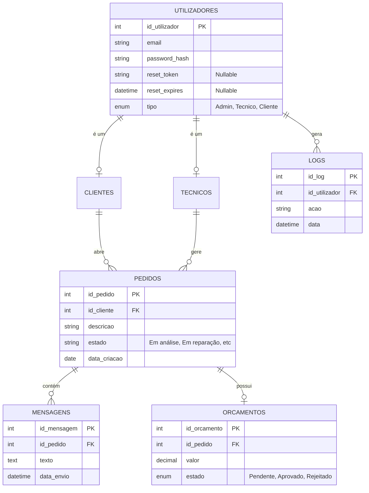

00 # Documentação do Projeto InfoConnect

> **Curso Profissional de Técnico de Gestão e Programação de Sistemas Informáticos**
> **Prova de Aptidão Profissional (PAP)**
>
> **Aluno:** Douglas Anjos (Nº 3)
> **Projeto:** Plataforma Digital - InfoConnect
> **Ano:** 2023 / 2026
> **Local:** Cantanhede

---

## Introdução

No contexto atual da sociedade da informação, a digitalização de processos empresariais tornou-se um requisito fundamental para garantir a competitividade e a eficiência operacional. O projeto **Plataforma Digital – InfoConnect** surge como resposta a esta necessidade no setor da assistência técnica informática, que frequentemente ainda depende de métodos manuais e desatualizados.

A presente Prova de Aptidão Profissional (PAP) tem como principal finalidade desenvolver uma aplicação web robusta que facilite o atendimento e a comunicação entre empresas de informática e os seus clientes. Com esta plataforma, pretende-se mitigar problemas comuns como a perda de informações, a dificuldade no acompanhamento de reparações por parte dos clientes e a demora na aprovação de orçamentos. O objetivo é tornar todo o processo de gestão de pedidos mais rápido, prático e automatizado, substituindo fichas de papel e telefonemas constantes por um sistema digital centralizado e eficiente.

A **InfoConnect** será uma plataforma online *Full-Stack* que permitirá aos clientes registarem pedidos de assistência técnica ou orçamentos a qualquer hora, acompanharem o estado do serviço em tempo real e comunicarem diretamente com a empresa através de um sistema de mensagens integrado.
As empresas poderão, por sua vez, gerir uma base de dados de pedidos e clientes, enviar orçamentos digitais para aprovação imediata, registar intervenções técnicas e consultar estatísticas detalhadas sobre os atendimentos realizados, permitindo uma tomada de decisão mais informada.

## 2. Objetivos do Projeto

### 2.1. Objetivo Geral
Conceber e implementar uma solução Web moderna que modernize o setor de reparação de equipamentos informáticos, eliminando a dependência do papel e centralizando toda a informação num único sistema acessível em qualquer lugar.

### 2.2. Objetivos Específicos
*   **Desmaterialização:** Substituir as fichas de papel por registos digitais seguros.
*   **Centralização:** Unificar dados de clientes, equipamentos e histórico de intervenções.
*   **Transparência:** Permitir que o cliente consulte o estado do seu equipamento ("Em análise", "Pronto a levantar") sem precisar de telefonar.
*   **Eficiência:** Automatizar o envio de orçamentos e a aprovação dos mesmos.
*   **Gestão:** Fornecer aos gestores dados estatísticos sobre a produtividade e volume de trabalho.

## 3. Público-Alvo

O sistema foi desenhado a pensar em dois perfis distintos de utilizadores:

*   **Empresas de Assistência Técnica (Ticket Managers):**
    *   Gestores e Técnicos de Informática que necessitam de uma ferramenta diária para organizar o laboratório e comunicar com os clientes.
*   **Clientes Finais (Ticket Requesters):**
    *   Particulares ou Empresas que entregam os seus equipamentos para reparação e desejam um acompanhamento simples, rápido e digital.

## 4. Justificativa Tecnológica

A escolha das tecnologias (MERN Stack adaptada: MySQL, Express, React, Node) justifica-se pela necessidade de criar uma aplicação **Rápida, Escalável e Moderna**:

*   **React (Frontend):** Permite criar uma interface reativa (SPA), onde a página não recarrega a cada clique, oferecendo uma experiência de utilização semelhante a uma aplicação nativa (App).
*   **Node.js & Express (Backend):** Utiliza JavaScript também no servidor, unificando a linguagem do projeto e permitindo tratar múltiplos pedidos em simultâneo de forma eficiente (No-Blocking I/O).
*   **MySQL (Base de Dados):** Sendo um sistema relacional robusto, garante a consistência dos dados (ACID), essencial para gerir relações complexas entre Clientes, Pedidos e Faturação (Orçamentos).

## 5. Arquitetura Geral do Projeto

O **InfoConnect** é uma plataforma web *Full-Stack* para gestão de suporte técnico, desenhada para facilitar a comunicação entre clientes e técnicos. A arquitetura baseia-se no modelo **Client-Server**:

*   **Frontend (SPA - Single Page Application):**
    *   Desenvolvido em **React** (v19) com **TypeScript**.
    *   Utiliza **Vite** para compilação rápida e Hot Module Replacement (HMR).
    *   Estilização moderna e responsiva com **Tailwind CSS**.
    *   Ícones vetoriais da biblioteca **Lucide React**.
*   **Backend (API RESTful):**
    *   Servidor **Node.js** com framework **Express**.
    *   Gerenciamento de uploads de ficheiros com **Multer**.
    *   Envio de emails transacionais (Recuperação de Senha) via **Nodemailer** (Gmail SMTP).
    *   Gestão de variáveis de ambiente com **Dotenv** (`.env`).
    *   Autenticação segura e encriptação de senhas com **Bcrypt**.
*   **Base de Dados (Relacional):**
    *   **MySQL** (MariaDB) servido via XAMPP.
    *   Estrutura normalizada para gestão de utilizadores, tickets, mensagens e logs.

## 2. Estrutura do Projeto

A organização de ficheiros foi adaptada para desenvolvimento ágil, mantendo os componentes principais na raiz para fácil acesso:

*   **Raiz (`/`)**:
    *   `App.tsx`: O "coração" do frontend. Contém o **Router personalizado** (baseado em estado), gestão de autenticação global e lógica de troca de temas.
    *   `index.html`: Ponto de entrada da aplicação web.
    *   `index.tsx`: Renderização do React no DOM.
    *   `server.cjs`: O servidor Backend completo num ficheiro modular.
    *   `types.ts`: Definições de tipagem TypeScript (Interfaces para User, Ticket, etc.).
*   **Componentes (`/components`)**:
    *   `Dashboard.tsx`: Visão geral para administradores (estatísticas, gráficos).
    *   `ClientDashboard.tsx`: Área exclusiva do cliente para ver seus tickets.
    *   `TicketDetail.tsx`: Interface completa de gestão de um ticket (chat, orçamentos).
    *   `AuthPage.tsx`: Ecrã de Login e Registo.
    *   `NewTicketModal.tsx`: Formulário para abertura de novos pedidos.
    *   `UsersManagement.tsx`: Painel de administração de utilizadores.
    *   `SystemLogs.tsx`: Visualizador de logs de sistema (auditoria).
    *   `FAQSection.tsx`, `ReportsPanel.tsx`, `LandingPage.tsx`: Outros módulos funcionais.
*   **Serviços (`/services`)**:
    *   `api.ts`: Camada de abstração para comunicação com o Backend (fetch wrapper).
*   **Configuração**:
    *   `tailwind.config.js`: Personalização do tema visual.
    *   `vite.config.ts`: Configurações de build.

## 3. Instalação das Ferramentas

O ambiente de desenvolvimento requer as seguintes tecnologias:

1.  **Node.js (LTS)**: Ambiente de execução JavaScript.
2.  **XAMPP**: Pacote com servidor Apache e MySQL (phpMyAdmin).
3.  **Visual Studio Code**: IDE recomendado com extensões (ESLint, Prettier).\
4.  **Git**: Controlo de versões.

*(Recomenda-se adicionar aqui prints da instalação do Node e XAMPP)*

## 4. Configuração do Ambiente de Desenvolvimento

Para colocar o projeto a funcionar localmente:

1.  **Backend**:
    *   Iniciar o **MySQL** no XAMPP.
    *   Importar o esquema da base de dados (`bd_infoconnect`).
    *   Na raiz do projeto, executar:
        ```bash
        node server.cjs
        ```
        *Saída esperada: "Servidor InfoConnect a correr na porta 3000"*

    *   **Variáveis de Ambiente**:
        *   Criar um ficheiro `.env` na raiz com as credenciais da Base de Dados e SMTP (Gmail).
        *   Ver exemplo em `.env.example`.

2.  **Frontend**:
    *   Num novo terminal, executar:
        ```bash
        npm install  # Instalar dependências
        npm run dev  # Iniciar servidor Vite
        ```
    *   Aceder a `http://localhost:5173`.

## 5. Desenvolvimento do Backend (API)

O backend expõe uma **API REST** na porta 3000. Abaixo os principais *endpoints* desenvolvidos:

### Autenticação e Utilizadores
| Método | Endpoint | Descrição |
| :--- | :--- | :--- |
| `POST` | `/api/login` | Autentica utilizador e retorna token/dados. |
| `POST` | `/api/register` | Regista novos clientes. |
| `POST` | `/api/auth/forgot-password` | Envia email com link de recuperação. |
| `POST` | `/api/auth/reset-password` | Redefine a senha usando o token. |
| `POST` | `/api/users` | Admin cria novos técnicos/admins. |
| `DELETE`| `/api/users/:id`| Remove um utilizador e seus dados associados. |

### Gestão de Pedidos (Tickets)
| Método | Endpoint | Descrição |
| :--- | :--- | :--- |
| `GET` | `/api/tickets` | Lista todos os tickets (com filtros). |
| `POST` | `/api/tickets` | Cria um novo ticket (suporta anexo). |
| `DELETE`| `/api/tickets/:id`| Apaga um ticket completo. |
| `PATCH` | `/api/tickets/:id/status`| Atualiza o estado (Em análise, Concluído...). |

### Comunicação e Orçamentos
| Método | Endpoint | Descrição |
| :--- | :--- | :--- |
| `GET` | `/api/tickets/:id/messages`| Obtém histórico do chat. |
| `POST` | `/api/tickets/:id/messages`| Envia nova mensagem (notifica por email). |
| `POST` | `/api/tickets/:id/budget` | Cria ou atualiza orçamento. |

### Sistema
| Método | Endpoint | Descrição |
| :--- | :--- | :--- |
| `GET` | `/api/logs` | Lista logs de auditoria do sistema. |
| `POST` | `/api/logs` | Regista uma ação importante. |
| `POST` | `/api/settings` | Guarda configurações globais. |

## 6. Desenvolvimento do Frontend

A interface foi focada na usabilidade (**UX/UI**).

*   **Template da Interface**: O design base e a estrutura visual foram fornecidos pela ferramenta **Google AI Studio**.
*   **Sistema de Rotas Personalizado**: Em vez de usar bibliotecas externas pesadas, foi implementado um gestor de estado simples em `App.tsx` (`currentView`), tornando a aplicação mais leve e rápida.
*   **Modo Escuro (Dark Mode)**: A interface adota agora um tema escuro ("Dark Mode") permanente e exclusivo, conferindo um aspeto moderno e profissional, reduzindo o cansaço visual.
*   **Dashboard Dinâmico**: O componente `Dashboard.tsx` adapta-se se o utilizador for Admin (vê tudo) ou Cliente (vê apenas os seus pedidos).
*   **Chat em Tempo Real (Simulado)**: O `TicketDetail.tsx` faz *polling* ou atualização otimista para mostrar mensagens enviadas instantaneamente.

## 7. Modelo da Base de Dados + DER

A base de dados `bd_infoconnect` utiliza integridade referencial para garantir dados consistentes.

### Diagrama Entidade-Relacionamento (DER)


```mermaid
erDiagram
    UTILIZADORES ||--o| CLIENTES : "é um"
    UTILIZADORES ||--o| TECNICOS : "é um"
    
    UTILIZADORES {
        int id_utilizador PK
        string email
        string password_hash
        string reset_token "Nullable"
        datetime reset_expires "Nullable"
        enum tipo "Admin, Tecnico, Cliente"
    }

    PEDIDOS {
        int id_pedido PK
        int id_cliente FK
        string descricao
        string estado "Em análise, Em reparação, etc"
        date data_criacao
    }

    MENSAGENS {
        int id_mensagem PK
        int id_pedido FK
        text texto
        datetime data_envio
    }

    ORCAMENTOS {
        int id_orcamento PK
        int id_pedido FK
        decimal valor
        enum estado "Pendente, Aprovado, Rejeitado"
    }

    LOGS {
        int id_log PK
        int id_utilizador FK
        string acao
        datetime data
    }

    CLIENTES ||--o{ PEDIDOS : "abre"
    TECNICOS ||--o{ PEDIDOS : "gere"
    PEDIDOS ||--o{ MENSAGENS : "contém"
    PEDIDOS ||--o| ORCAMENTOS : "possui"
    UTILIZADORES ||--o{ LOGS : "gera"
```

## 8. Funcionalidades do Sistema

1.  **Painel de Controlo (Dashboard)**
    *   Visão rápida de tickets pendentes, em progresso e concluídos.
    *   Gráficos estatísticos para administradores (via `Recharts`).

2.  **Gestão de Tickets**
    *   Clientes criam pedidos com descrição e upload de fotos/erros.
    *   Técnicos alteram estados e respondem a dúvidas.

3.  **Sistema de Orçamentação**
    *   Técnico envia proposta de valor.
    *   Cliente aprova ou rejeita diretamente na plataforma.
    *   Geração automática de registo no histórico.

4.  **Auditoria e Logs**
    *   O sistema regista automaticamente ações críticas (Login, Apagar Ticket, Alterar Permissões) para segurança.

5.  **Gestão de Utilizadores**
    *   CRUD completo de utilizadores.

    *   Proteção contra remoção do próprio administrador.

6.  **Recuperação de Conta**
    *   Sistema seguro de "Esqueci-me da Palavra-passe".
    *   Envio de token temporário por Email (SMTP Google).
    *   Redefinição de credenciais sem intervenção administrativa.

## 10. Segurança e Proteção de Dados

A segurança foi uma prioridade desde o início do desenvolvimento, seguindo as boas práticas da OWASP:

1.  **Encriptação de Passwords:** Utilização da biblioteca **Bcrypt** para transformar as senhas dos utilizadores em *hashes* irreversíveis antes de as guardar na base de dados.
2.  **Proteção contra SQL Injection:** Uso de *Prepared Statements* (queries parametrizadas) em todas as interações com o MySQL.
3.  **Sanitização de Dados:** Validação de todos os inputs no Backend para impedir o envio de dados maliciosos.
4.  **CORS (Cross-Origin Resource Sharing):** Configuração restritiva para permitir apenas pedidos do Frontend autorizado.

## 11. Metodologia de Desenvolvimento

O projeto seguiu uma abordagem híbrida, combinando o planeamento estruturado com a flexibilidade do desenvolvimento ágil:

1.  **Fase de Análise:** Levantamento de requisitos e criação do Diagrama Entidade-Relacionamento (DER).
2.  **Fase de Design:** Criação de protótipos em *wireframes* e definição da paleta de cores.
3.  **Fase de Implementação (Iterativa):**
    *   *Sprint 1:* Configuração do Servidor e Base de Dados.
    *   *Sprint 2:* Sistema de Login e Registo.
    *   *Sprint 3:* Funcionalidades Críticas (Tickets e Orçamentos).
    *   *Sprint 4:* Refinamento de UI e Testes.
4.  **Fase de Testes e Documentação:** Verificação final e elaboração deste relatório.

## 12. Conclusão Final e Trabalho Futuro

O desenvolvimento da plataforma **InfoConnect** permitiu consolidar os conhecimentos adquiridos ao longo do curso, resultando numa aplicação funcional e pronta a ser testada em ambiente real de uma loja de informática.

**Principais Conquistas:**
*   Criação de um sistema robusto de gestão de estados (Tickets e Orçamentos).
*   Interface intuitiva e adaptável a dispositivos móveis.
*   Implementação bem-sucedida de funcionalidades complexas como Uploads e Gráficos estatísticos.

**Limitações e Melhorias Futuras:**
Apesar de funcional, o projeto tem margem para evoluir:
*   **Notificações em Tempo Real (WebSockets):** Para o chat ser instantâneo sem precisar de recarregar.
*   **Integração com WhatsApp:** Envio de alertas automáticos para o telemóvel do cliente.
*   **Módulo de Faturação:** Geração de faturas PDF certificadas.

Em suma, a InfoConnect cumpre o seu propósito de modernizar o atendimento técnico, provando ser uma ferramenta valiosa tanto para técnicos como para clientes.

## 13. Bibliografia e Referências

*   **Documentação React:** https://react.dev/
*   **Documentação Node.js:** https://nodejs.org/en/docs/
*   **W3Schools SQL Tutorial:** https://www.w3schools.com/sql/
*   **Lucide Icons:** https://lucide.dev/
*   **Stack Overflow:** Consultas diversas para resolução de erros específicos.
